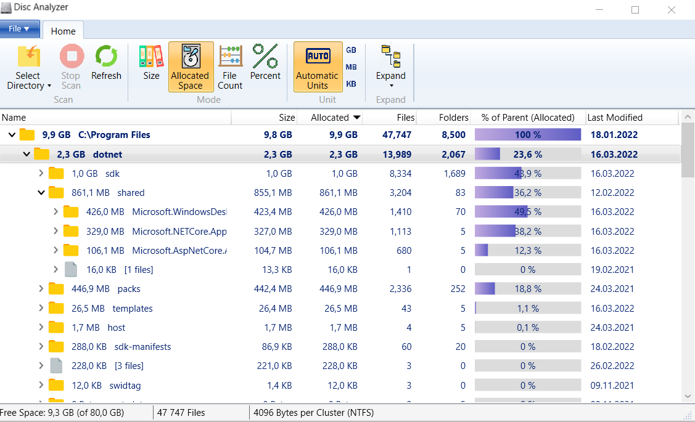

# Disc analyzer
Desktop application for Windows. The software shows you the sizes of folders including all subfolders.

## Table of Contents
* [General Info](#general-information)
* [Technologies Used](#technologies-used)
* [Features](#features)
* [Screenshots](#screenshots)
* [Contact](#contact)

## General Information
- The application allows you to see the size of all folders including all subfolders and break it down to file level.
- It is possible to select any logical drive or folder for analysis.
- The application shows you the size and allocated space of files and folders, number of files in each folder and how much percent of the parent folder each file or folder occupies.
- You can easily find large folders or subfolders in the Windows Explorer-like tree view.

## Technologies Used
- WPF - version 5.0
- MVVM architecture and Command pattern
- Task Parallel Library
- Fody
- Win32 API
- NLog
- Microsoft.Extensions.DependencyInjection
- Global exception handling

## Features
List the ready features here:
- Asynchronous and parallel execution
- Ability to stop or refresh scanning using CancellationToken
- Several modes of information display (based on size, allocated space or files count)
- Choose appropriate unit dependent on size of object
- Sorting files and folders by column
- Expanding tree folder structure on several levels
- Different logging modes depending on build config
- Ribbon window style

## Screenshots

## Contact
Created by [@Dmitriy Bulynko](https://linkedin.com/in/дмитрий-булынко-10bb53227) - feel free to contact me!
